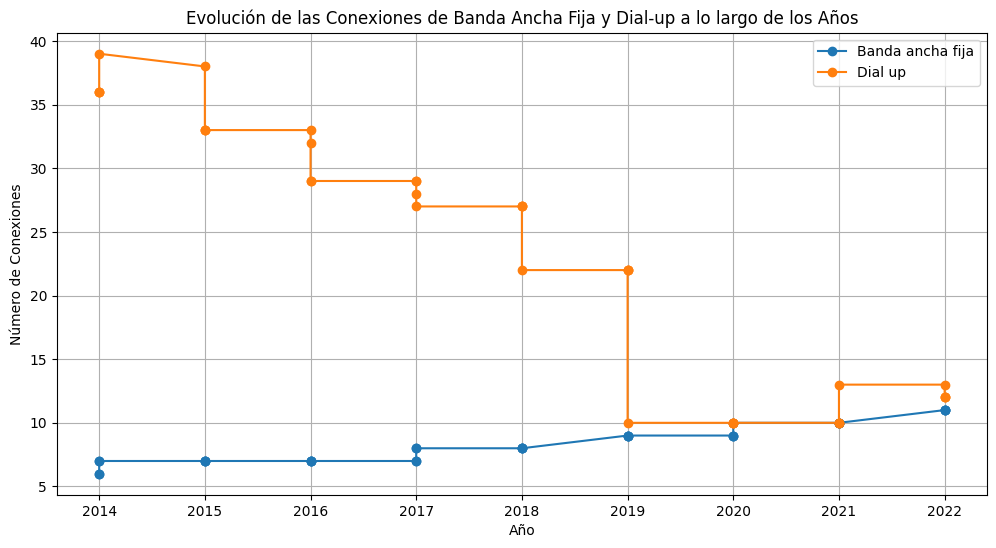
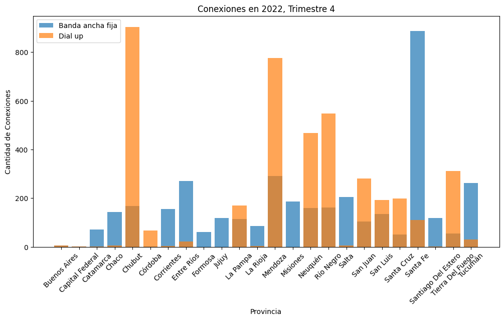
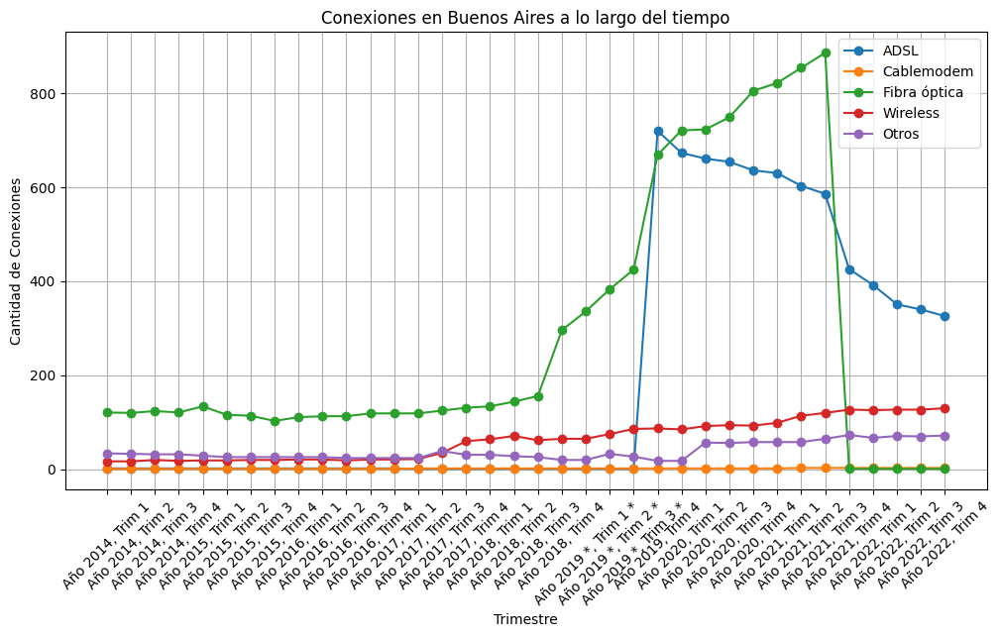

# Proyecto Individual Data Analyst

    

### En este proyecto se lleva a cabo el rol de un Data Analyst en una empresa prestadora de servicios de telecomunicaciones, tenemos acceso a multiples datasets que se nos facilitan, siendo estos un total de 15 archivos CSV.

## EDA
Se nos solicita un analisis completo de los datos de los 15 archivos CSV

- Se da un vistazo general de todos los datasets
- Se visualizan datos estadisticos de los datasets con el objetivo de encontrar outliers, se obtuvo como resultado algunos outliers los cuales decidi ignorar debido a que no se los podia eliminar.
- Se realiza la eliminacion de columnas basura en algunos datasets
- Busqueda y eliminacion de valores nulos
- Busqueda y eliminacion de valores duplicados
- Se descartan datasets que son iguales a otros o que poseen informacion demasiado especifica para lo necesario.
- Se realizan graficos de los datasets restantes junto con una breve explicacion de los mismos:

Como podemos ver en este grafico las conexiones de Banda ancha fija se mantuvieron de forma estable y un poco ascendente desde 2014 hasta 2022, entre estos mismo años tambien podemos ver como fue disminuyendo las conexiones Dial up hasta terminar de forma un poco estable junto con las conexiones de Banda ancha fija

Con este grafico podemos ver que tipos de conexiones abundan mas en las distintas provincias de Argentina, en este caso lo vemos para el año 2022 en su cuarto trimestre, podemos notar que la provincia de Chubut tiene mas conexiones Dial up que conexiones de Banda ancha fija, mientras que por ejemplo Santa Fe es lo contrario.

Como podemos ver en este grafico se nos marca la cantidad de conexiones para distintos tipos de conexiones en Buenos Aires, podemos ver que el tipo mas dominante para finales de 2022 es el tipo ADSL y tambien podemos ver que se utiliza Wireless y un poco de "otros" tipos de conexiones

## Streamlit
Se utiliza streamlit para poder plasmar algunos de estos graficos de forma mas interactiva a su vez que se realiza un KPI:
- Aumentar en un 2% el acceso al servicio de internet para el próximo trimestre, cada 100 hogares, por provincia. La fórmula es la siguiente:
KPI = ((Nuevoacceso - Accesoactual)/ Accesoactual) * 100